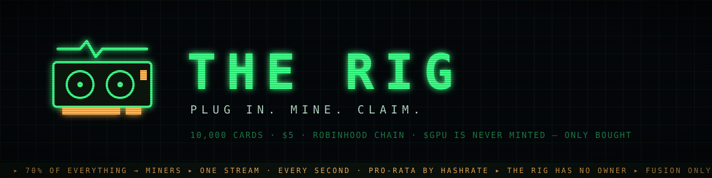

<p align="center">
  
</p>

<p align="center">
  <a href="https://github.com/HannaPrints/The-Rig/actions/workflows/test.yml"></a>
  
  
  <a href="LICENSE"></a>
</p>

<h3 align="center">A mining game on Robinhood Chain.<br/>Mint a graphics card for $5, slot it into your rig, and it earns $GPU for as long as it's plugged in.</h3>

<p align="center"><a href="https://opensea.io/assets/robinhood/0xa35ec0e14fb2b325cca9eb0caf3e9cbdb1a8acb6"><b>Collection on OpenSea ↗</b></a> — OpenSea indexes Robinhood Chain natively; the link resolves at deploy.</p>

<p align="center"><b>$GPU is never minted. Only bought.</b><br/><sub>Building fully in public — every contract, every decision, every number, right here.</sub></p>

---

```
burn $GPU → mint → slot in → mine $GPU → claim → spend into upgrades → mine harder
```

## The game

**10,000 graphics cards, $5 each.** Every card rolls a tier from randomness committed *before* your transaction lands:

| Tier | Card | MH/s | Odds |
|---|---|---:|---:|
| Common | Spud GT 210 | 10 | 52% |
| Uncommon | Miner MX 450 | 25 | 26% |
| Rare | Volt VX 3060 | 60 | 13% |
| Epic | Blaze BZ 4080 | 150 | 7% |
| Legendary | Quantum QX 9090 | 400 | 2% |
| Mythic | Singularity ∞ | 1,000 | fusion only |
| Forged | ??? | 2,500 | fusion only |

- **One stream, every second, pro-rata by hashrate.** Rewards drip over rolling 12-hour windows and the stream pauses when the rig is empty — time never steals from miners.
- **The money loop:** 70% of every mint, overclock, fusion, rack, and royalty buys $GPU on the open market and streams it straight to miners — plus 30% of the creator share of $GPU's own trading fees on [Pons](https://pons.fun) (the other 70% funds the project treasury).
- **The burn:** every mint torches 12,500 $GPU from your wallet. Full mint = 125,000,000 burned — 12.5% of everything that will ever exist.
- **Climb:** overclock (+20%/level, max +100%), fuse two identical cards into the next tier (supply only shrinks), expand your room from 4 to 52 slots.

## The trust model

| Piece | Power | Ceiling |
|---|---|---|
| `Rig` | none — **no owner** | no pause, no parameters, no withdraw |
| Keeper | buy $GPU with the pot | min-output + balance-delta verified; can't pay itself |
| `RoyaltyRouter` | none — no owner at all | hardcoded 70/30, permissionless flush |
| Shop owner | rotate permit signer, tune burn dial | dial is band-limited at deploy; can't touch cards or the 70% |
| Mint randomness | committed in the signed permit | reproducible by anyone, riggable by no one |

Anti-bot by construction: contracts can't mint and permits expire in 5 minutes. **No mint caps, no cooldowns — mint as many as you want, whenever you want.**

## The monorepo

```
src/        Solidity — RigCard · Shop · Rig · BuybackVault · RoyaltyRouter · Workshop · adapters
test/       34 Foundry tests
script/     deployment
services/   permit signer (the bot gate + committed randomness) · buyback keeper
web/        the site — Vite + React + wagmi
docs/       the full protocol deep dive & economic model
```

```bash
# contracts
forge build && forge test

# services
cd services && npm i && npm run typecheck   # npm run signer / npm run keeper

# site
cd web && npm i && npm run dev
```

Deploy: `forge script script/Deploy.s.sol --rpc-url https://rpc.mainnet.chain.robinhood.com --broadcast` with `GPU_TOKEN`, `ETH_USD_FEED`, `SWAP_ADAPTER`, `KEEPER`, `SIGNER`, `TREASURY` set.

## Status

- [x] Protocol deep dive & economic model — [docs/DEEPDIVE.md](docs/DEEPDIVE.md)
- [x] Core contracts + 34 passing tests
- [x] Pons bonding-curve adapter + Uniswap v3 adapter (v4 adapter lands at graduation)
- [x] Pons creator-fee wiring — ownerless `PonsFeeRouter`, verified against the live escrow
- [x] Buyback keeper (curve-simulation quotes, price-impact ladder, graduation detection)
- [x] Permit signer service
- [x] The site
- [x] Mainnet launch runbook + **deterministic CA prediction** — [docs/DEPLOY.md](docs/DEPLOY.md)
- [x] **Full mainnet-fork dry run** — launch → deploy → trade → fees → buyback → mint → mine → claim, all green (`script/dryrun-fork.sh`, results in [docs/DEPLOY.md](docs/DEPLOY.md))
- [ ] Freeze token metadata → final CA
- [ ] Audit
- [ ] Card art
- [ ] $GPU launch on Pons
- [ ] Mint

## Not financial advice

Unaudited. Unlaunched. The rig has no owner, the keeper can only buy, and the code is public — but this is a game. **Only spend what you are happy to lose.**
